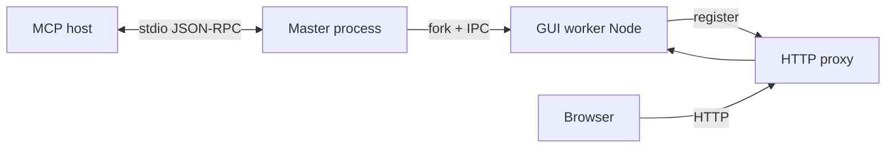

# @imenam/mcp-gui-interface

Shared library for MCP GUI lifecycle management — spawning, IPC, proxy registration, and logging.

This package encapsulates the boilerplate many MCP servers need when they run a companion GUI: spawning a child process safely, communicating over IPC, registering with the central HTTP proxy, and logging without polluting **stdout** (reserved for MCP JSON-RPC on the parent process).

---

## Installation

```bash
npm install @imenam/mcp-gui-interface
```

No runtime dependencies. Requires Node.js with ESM support (`"type": "module"` in consuming packages).

---

## Scope: Node only

This package targets **Node.js processes** (MCP master and GUI worker). It is **not** meant for browser or Vite bundles — do not add it as a dependency of a React/Vite front-end.

---

## How it fits together

1. **MCP host** (e.g. Cursor) talks **only** to the **master** process over **stdio** (JSON-RPC). Nothing from this library runs in the host.
2. The **master** may use **`GuiLauncher`** to **fork** a second Node process: the **GUI worker**. They talk over Node **IPC** (`process.send` / `message`).
3. The **worker** starts an HTTP server (Express, Hono, …) and usually uses **`ProxyClient`** to register with your **HTTP proxy** so the UI gets a stable URL. It also serves the built SPA (static files).
4. The **browser** loads that SPA. It talks to the worker via **HTTP** (`fetch`, SSE). It does **not** import this npm package—the worker is already a Node server.

So: **two Node processes** (master + worker) may both depend on this package; the **browser bundle** must not.



For a longer French walkthrough, see **MCP Documentor** → project **`mcp-gui-interface`** → *Guide d’utilisation — @imenam/mcp-gui-interface*.

---

## Why this library exists

MCP servers talk to the host (Cursor, Claude Desktop, etc.) over **stdout** using JSON-RPC. Any stray `console.log` on stdout can corrupt the protocol.

When an MCP server also serves a GUI (Express, Hono, etc.), it typically must:

1. **Fork** the GUI as a **separate child process** so the GUI’s stdout does not mix with the parent’s JSON-RPC channel.
2. Exchange messages over **Node IPC** (`process.send` / `message`).
3. **Register** the GUI with the central proxy ([mcp-http-gateway](https://github.com/Matthieu-Pesnot-Pin/mcp-http-gateway)) so it is reachable under a stable path.
4. **Log safely** — stderr and/or a log file; never rely on stdout for logs in the master process.

This library supports these patterns via `GuiLauncher`, `IpcHub`, `ProxyClient`, and `setupLogging` / `createLogger`.

---

## API reference

### `GuiLauncher`

Spawns and supervises a GUI child process (`fork` with `stdio: ['ignore', 'pipe', 'inherit', 'ipc']` — child stdout is piped to the parent’s stderr).

```typescript
import { GuiLauncher } from "@imenam/mcp-gui-interface";

const launcher = new GuiLauncher({
  guiPath: "./dist/gui-worker.js",
  env: { ...process.env } as Record<string, string>,
  maxRestarts: 0, // default: 0 — no auto-restart unless you opt in
  restartDelay: 2000, // default: 2000 ms between restart attempts
  onMessage: (msg) => {
    console.error("Received:", msg);
  },
});

launcher.start();
```

**`GuiLauncherOptions`**

| Property       | Type                         | Default | Description |
|----------------|------------------------------|---------|-------------|
| `guiPath`      | `string`                     | —       | Path to the GUI entry script (forked with Node) |
| `env`          | `Record<string, string>`     | —       | Extra env vars merged with `process.env` |
| `maxRestarts`  | `number`                     | **`0`** | Auto-restarts after unexpected exit (non-zero code) |
| `restartDelay` | `number`                     | `2000`  | Ms to wait before each restart |
| `onMessage`    | `(msg: IpcMessage) => void`  | —       | Incoming IPC from the child |

**Methods**

| Method           | Returns              | Description |
|------------------|----------------------|-------------|
| `start()`        | `ChildProcess`       | Spawns or respawns the GUI |
| `send(message)`  | `boolean`            | Sends IPC to the child (timestamp added internally) |
| `getIpcHub()`    | `IpcHub`             | Lower-level IPC helper |
| `getProcess()`   | `ChildProcess \| null` | Current child, if any |
| `cleanup()`      | `Promise<void>`      | SIGTERM, then SIGKILL after 3s if needed |

The launcher registers handlers for `SIGINT`, `SIGTERM`, parent `exit`, and stdin `close` to tear down the child.

---

### `IpcHub`

Typed IPC between parent and child. Usually obtained via `launcher.getIpcHub()`.

```typescript
const ipc = launcher.getIpcHub();

ipc.send({
  type: "CONFIG_UPDATE",
  data: { theme: "dark" },
  timestamp: new Date().toISOString(),
});

const response = await ipc.request({ type: "GET_STATUS" }, 3000);
```

**`IpcMessage`**

```typescript
interface IpcMessage {
  type: string;
  correlationId?: string;
  data?: any;
  error?: string;
  timestamp: string;
}
```

**Methods**

| Method                     | Description |
|----------------------------|-------------|
| `send(message)`            | Returns `false` if not connected |
| `onMessage(callback)`      | Only delivers objects with a `type` field |
| `request(message, timeout?)` | Default timeout **2000 ms** |

---

### `ProxyClient`

Registers / unregisters the GUI with the proxy (`POST /proxy/register`, `DELETE /proxy/unregister`).

**Current API (source / recent releases):**

```typescript
import { ProxyClient } from "@imenam/mcp-gui-interface";

const proxy = new ProxyClient(process.env.PROXY_URL!);

const result = await proxy.register({ path: "/my-app", name: "My App" });

if (result.success) {
  console.error(`Listening on port ${result.port}`, result.url);
} else {
  console.error(result.error, result.port); // port is 0 on failure
}

await proxy.unregister();
```

- Registration HTTP timeout: **1000 ms** (unregister: **2000 ms**).
- On failure, `RegisterResult.port` is **`0`** in the current implementation.

**Grouping (`group` / `APP_GROUP`):** pass an optional `group` in the register
options to place the app under a collapsible section (folded by default) in the
proxy dashboard. Apps sharing the same `group` are shown together; apps without
one land in a default "ungrouped" section. When `group` is omitted, `register`
falls back to the **`APP_GROUP`** environment variable, so an MCP can enable
grouping purely from its `.env` without touching code:

```typescript
// Explicit:
await proxy.register({ path: "/my-app", name: "My App", group: "Google" });

// Or, with APP_GROUP=Google in the environment, simply:
await proxy.register({ path: "/my-app", name: "My App" });
```

> **Older npm versions** may have exposed `register(options, fallbackPort)`. Check `node_modules/@imenam/mcp-gui-interface/dist/src/proxy-client.d.ts` for the exact signature you have installed.

**`getStatus()`:** `"connected" | "fallback" | "error"` — many failure paths set `"error"`.

---

### `setupLogging` / `createLogger`

Safe logging for MCP servers: protect stdout, mirror errors to a file.

```typescript
import { setupLogging, createLogger } from "@imenam/mcp-gui-interface";

setupLogging({
  processLabel: "MY-MCP",
  logDir: "./logs", // optional; overrides MCP_LOG_DIR env var and .mcp-gui/logs default
});

const logger = createLogger("MyModule");
logger.info("Server started");
```

**`setupLogging`**

- Runs once per process (subsequent calls are no-ops).
- Creates `logDir`, appends to **`server.log`** (single file — **no built-in rotation**).
- Redirects `console.log` / `info` / `warn` → `console.error`.
- Patches `console.error` to also append to the log file.

**Log directory resolution order:**

1. `logDir` option passed to `setupLogging`
2. `MCP_LOG_DIR` environment variable
3. `.mcp-gui/logs` relative to `process.cwd()` (default)

**`createLogger(scope)`** — logs to stderr with `[LEVEL] [scope] …`.

---

## Full-stack usage sketch

Typical split:

1. **Master:** `setupLogging`, optional `GuiLauncher` + `start()` when `PROXY_URL` (or your policy) allows.
2. **GUI worker:** `setupLogging`, `ProxyClient.register`, bind HTTP server to returned port, `unregister` on shutdown.

The master example in older docs that called `ProxyClient` in the same process as `GuiLauncher` is valid for simple layouts; **Hono-based** MCPs (e.g. MCP Documentor) often register the proxy **only** in the worker.

---

## Exported types

```typescript
import type {
  GuiLauncherOptions,
  IpcMessage,
  RegisterOptions,
  RegisterResult,
  ProxyConfig,
  Logger,
  SetupLoggingOptions,
} from "@imenam/mcp-gui-interface";
```

---

## Development

```bash
npm run build        # tsc → dist/
npm run build:watch
npm run release      # version patch, build, publish, push tags
```

---

## Documentation interne

Un **guide d’utilisation** (comment intégrer la lib dans un MCP + GUI) est maintenu dans **MCP Documentor**, projet **`mcp-gui-interface`**, entrée *Guide d’utilisation — @imenam/mcp-gui-interface* (dossier `guide`).

---

## License

ISC © [Matthieu Pesnot-Pin](https://github.com/Matthieu-Pesnot-Pin)
